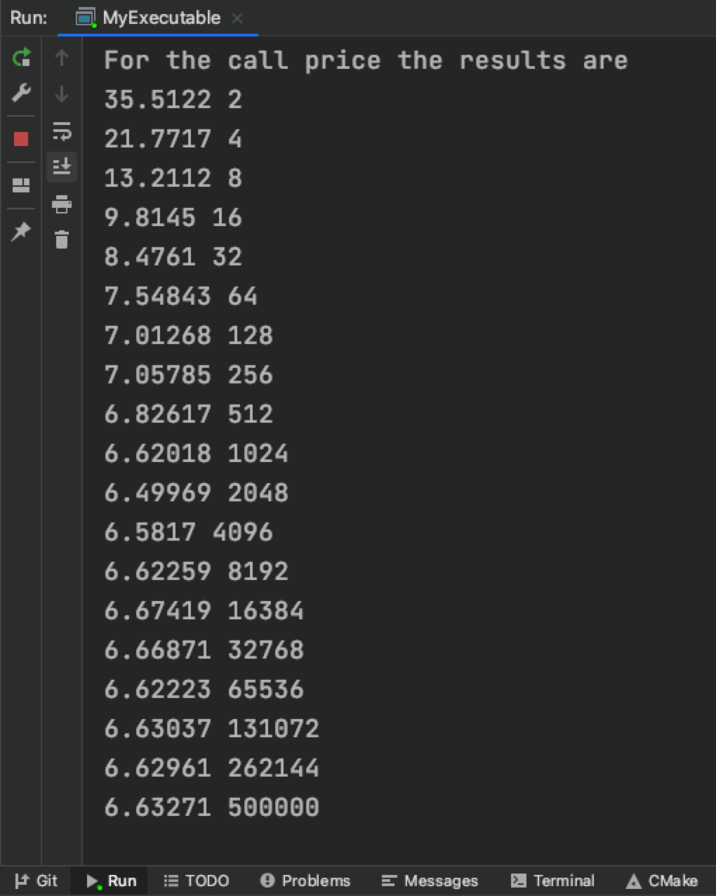
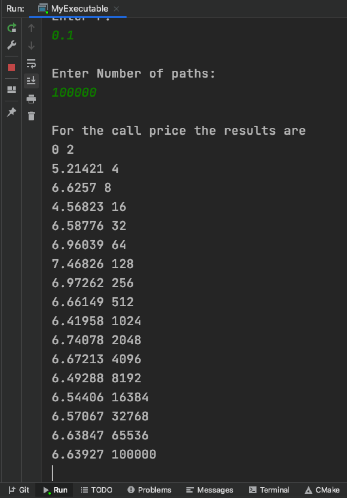

# Exercise 6.1

In **RandomMain3.cpp**, `GenTwo` use `RandomParkMiller` as inner generator. So to compare convergence of Monte Carlo simulations with and without anti-thetic sampling, we just need to use `generator` and `GenTwo` as generator in `SimpleMonteCarlo6` function and compare their results:

- For anti-thetic sampling:

    ```cpp
    SimpleMonteCarlo6(theOption,
                    Spot,
                    VolParam,
                    rParam,
                    NumberOfPaths,
                    gathererTwo,
                    GenTwo);
    ```

- For without anti-thetic sampling:

    ```cpp
    SimpleMonteCarlo6(theOption,
                    Spot,
                    VolParam,
                    rParam,
                    NumberOfPaths,
                    gathererTwo,
                    generator);
    ```

Results:

Let expiry=1, Strike=50, spot=50, vol=0.2, r=0.1, # paths=500000:




Let expiry=1, Strike=45, spot=50, vol=0.2, r=0.1, # paths=500000:


We can find that simulations with anti-thetic sampling converges relatively faster.

# Exercise 6.2

Using boost library and fit it into the `RandomBase` class:

**Random3.h**:

```cpp
#ifndef CLIONPROJECT_RANDOM3_H
#define CLIONPROJECT_RANDOM3_H

#include "Random2.h"
#include "Wrapper.h"

class BoostRandom:public RandomBase{
public:
    BoostRandom(unsigned long Dimensionality, unsigned long Seed=1);
    virtual RandomBase* clone() const;
    virtual void GetUniforms(MJArray& variates);
    virtual void Skip(unsigned long numberOfPaths);
    virtual void SetSeed(unsigned long Seed);
    virtual void Reset();

private:
    unsigned long Seed;
};
#endif //CLIONPROJECT_RANDOM3_H
```

**Random3.cpp**:

```cpp
#include "Random3.h"
#include "boost/random.hpp"
#include "boost/random/random_device.hpp"

BoostRandom::BoostRandom(unsigned long Dimensionality, unsigned long Seed_):
RandomBase(Dimensionality), Seed(Seed_){}

RandomBase* BoostRandom::clone() const {
    return new BoostRandom(*this);
}

void BoostRandom::GetUniforms(MJArray &variates) {
    boost :: random_device dev;
    boost :: mt19937 rng(dev);
    boost :: uniform_01<> std;
    for (unsigned long j=0; j < GetDimensionality(); j++){
        variates[j] = std(rng);
    }
}

void BoostRandom::Skip(unsigned long numberOfPaths)
{
    MJArray tmp(GetDimensionality());
    for (unsigned long j=0; j < numberOfPaths; j++)
        GetUniforms(tmp);
}

void BoostRandom::SetSeed(unsigned long Seed_) {
    Seed = Seed_;
}

void BoostRandom::Reset() {
    Seed = 1;
}
```

In **RandomMain3.cpp**, we add `BoostRandom` generator:

```cpp
#include "Random3.h"
...
BoostRandom generator2(1);
// for call option
SimpleMonteCarlo6(theOption,
                    Spot,
                    VolParam,
                    rParam,
                    NumberOfPaths,
                    gathererTwo,
                    generator2);
...
```

Result:

Let expiry=1, Strike=50, spot=50, vol=0.2, r=0.1, # paths=100000:


Note that here I use `uniform_01` in boost library to generate uniform numbers and still use `GetGaussians` in `RandomBase` to generate normal-distributed numbers from uniform-distributed numbers. We can also use `normal_distribution` to generate normal-distributed numbers directly, by overriding `GetGaussians` and implement it in **Random3.cpp**:

```cpp
void BoostRandom::GetGaussians(MJArray &variates) {
    boost :: random_device dev;
    boost :: mt19937 rng(dev);
    boost :: normal_distribution<> std(0,1);
    for (unsigned long j=0; j < GetDimensionality(); j++){
        variates[j] = std(rng);
    }
}
```

Result:

Let expiry=1, Strike=50, spot=50, vol=0.2, r=0.1, # paths=100000:


